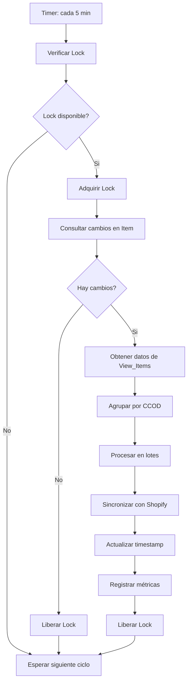

# Motor de Sincronización Automática RMS → Shopify

## Descripción General

El motor de sincronización automática es el corazón del sistema de integración, detectando cambios en la base de datos RMS usando la tabla `Item.LastUpdated` y sincronizando automáticamente los productos modificados hacia Shopify. El sistema funciona continuamente en background desde el arranque de la aplicación, proporcionando sincronización en tiempo real sin intervención manual.

## 🚀 Características Principales

- **Detección en Tiempo Real**: Monitoreo continuo de cambios cada 5 minutos
- **Sincronización Inteligente**: Solo sincroniza productos realmente modificados
- **Auto-Recovery**: Recuperación automática de fallos y errores
- **Métricas Avanzadas**: Estadísticas detalladas y monitoreo en tiempo real
- **Rate Limiting**: Respeto automático a límites de API de Shopify
- **Procesamiento por Lotes**: Optimización de performance con batches configurables
- **Lock Mechanism**: Prevención de ejecuciones concurrentes
- **Health Monitoring**: Sistema de salud con alertas automáticas

## ¿Cómo Funciona?

### 1. Detección de Cambios Basada en Timestamps

El sistema utiliza una aproximación inteligente combinando dos tablas:

**Tabla Item** - Para detectar cambios:
```sql
SELECT TOP (@batch_size)
    ID as ItemID,
    LastUpdated,
    DateCreated,
    ItemLookupCode
FROM Item 
WHERE LastUpdated > @last_sync_time
    AND LastUpdated IS NOT NULL
    AND LastUpdated <= GETUTCDATE()
ORDER BY LastUpdated ASC
```

**Vista View_Items** - Para datos completos:
```sql
SELECT 
    ItemID, C_ARTICULO, Description, Price, Quantity,
    Familia, Categoria, color, talla, CCOD,
    SalePrice, SaleStartDate, SaleEndDate,
    ExtendedCategory, Tax, Exis00, Exis57,
    Genero, UPC, Weight, Manufacturer
FROM View_Items 
WHERE ItemID IN (@modified_item_ids)
    AND C_ARTICULO IS NOT NULL 
    AND Description IS NOT NULL
    AND Price > 0
    AND (@include_zero_stock = 1 OR Quantity > 0)
```

### 2. Flujo de Procesamiento Completo


```mermaid
graph TD
    A[Timer: cada 5 min] --> B[Verificar Lock]
    B --> C{Lock disponible?}
    C -->|No| D[Esperar siguiente ciclo]
    C -->|Si| E[Adquirir Lock]
    E --> F[Consultar cambios en Item]
    F --> G{Hay cambios?}
    G -->|No| H[Liberar Lock]
    G -->|Si| I[Obtener datos de View_Items]
    I --> J[Agrupar por CCOD]
    J --> K[Procesar en lotes]
    K --> L[Sincronizar con Shopify]
    L --> M[Actualizar timestamp]
    M --> N[Registrar métricas]
    N --> O[Liberar Lock]
    H --> D
    O --> D
```

### 3. Características Avanzadas del Motor

#### A. Sistema de Locks
- **Previene ejecuciones concurrentes** 
- **Timeout configurable** (default: 30 minutos)
- **Auto-liberación** en caso de fallos
- **Detección de locks huérfanos**

#### B. Health Monitoring
- **Verificación cada 5 minutos** del estado del motor
- **Detección automática** si el motor se detiene
- **Restart automático** en caso de fallos
- **Alertas** cuando el motor no responde

#### C. Métricas en Tiempo Real
- **Productos sincronizados por hora/día**
- **Tiempo promedio de procesamiento**
- **Tasa de éxito/error**
- **Performance del sistema**

## Configuración Completa

### Variables de Entorno Principales

```bash
# === MOTOR DE SINCRONIZACIÓN AUTOMÁTICA ===

# Activación del motor (requerido)
ENABLE_SCHEDULED_SYNC=true

# Configuración de timing
SYNC_INTERVAL_MINUTES=5                 # Intervalo de verificación
SYNC_STARTUP_DELAY_SECONDS=60          # Delay inicial al arrancar
SYNC_HEALTH_CHECK_INTERVAL=300         # Health check cada 5 min

# Configuración de lotes
SYNC_BATCH_SIZE=10                      # Productos por lote
SYNC_MAX_CONCURRENT_JOBS=3             # Jobs paralelos máximos
SYNC_BATCH_DELAY_SECONDS=2             # Delay entre lotes

# Timeouts y límites
SYNC_TIMEOUT_MINUTES=30                 # Timeout operación completa
SYNC_OPERATION_TIMEOUT_SECONDS=600     # Timeout por operación
SYNC_MAX_ITEMS_PER_RUN=500             # Máximo items por ejecución

# Control de concurrencia
ENABLE_SYNC_LOCK=true                   # Activar mecanismo de locks
SYNC_LOCK_TIMEOUT_SECONDS=1800         # Timeout del lock (30 min)
SYNC_LOCK_RETRY_ATTEMPTS=3             # Reintentos para obtener lock

# Configuración de datos
SYNC_INCLUDE_ZERO_STOCK=false          # Incluir productos sin stock
SYNC_FORCE_UPDATE=false                # Forzar actualización siempre
RMS_SYNC_INCREMENTAL_HOURS=24          # Ventana incremental (horas)
```

### Variables de Entorno Avanzadas

```bash
# === CONFIGURACIÓN AVANZADA ===

# Performance y optimización
SYNC_USE_CONNECTION_POOLING=true       # Pool de conexiones DB
SYNC_CONNECTION_POOL_SIZE=10           # Tamaño del pool
SYNC_ENABLE_QUERY_CACHE=true           # Cache de consultas
SYNC_CACHE_TTL_SECONDS=300             # TTL del cache

# Retry y recovery
SYNC_ENABLE_AUTO_RECOVERY=true         # Auto-recovery habilitado
SYNC_RECOVERY_CHECK_INTERVAL=300       # Check cada 5 minutos
SYNC_MAX_RECOVERY_ATTEMPTS=5           # Intentos de recuperación
SYNC_RECOVERY_BACKOFF_MULTIPLIER=2     # Multiplicador de backoff

# Logging y monitoreo
SYNC_ENABLE_DETAILED_LOGGING=true      # Logs detallados
SYNC_LOG_PERFORMANCE_METRICS=true      # Métricas en logs
SYNC_ENABLE_PROGRESS_TRACKING=true     # Tracking de progreso

# Filtros y exclusiones
SYNC_EXCLUDED_CATEGORIES=              # Categorías a excluir
SYNC_EXCLUDED_FAMILIES=                # Familias a excluir
SYNC_MIN_PRICE_THRESHOLD=0.01          # Precio mínimo
SYNC_MAX_PRICE_THRESHOLD=999999.99     # Precio máximo

# Alertas
SYNC_ENABLE_ALERTS=true                # Alertas automáticas
SYNC_ALERT_ERROR_THRESHOLD=5           # Umbral de errores
SYNC_ALERT_PERFORMANCE_THRESHOLD=300   # Umbral de performance (seg)
```

### Configuración por Entorno

#### Desarrollo Local
```bash
# .env.development
ENABLE_SCHEDULED_SYNC=true
SYNC_INTERVAL_MINUTES=10               # Más lento para desarrollo
SYNC_BATCH_SIZE=5                      # Lotes pequeños
SYNC_MAX_CONCURRENT_JOBS=1             # Un solo job
SYNC_ENABLE_DETAILED_LOGGING=true      # Logs detallados
SYNC_INCLUDE_ZERO_STOCK=true           # Incluir todo para testing
```

#### Staging
```bash
# .env.staging
ENABLE_SCHEDULED_SYNC=true
SYNC_INTERVAL_MINUTES=10               # Intervalo intermedio
SYNC_BATCH_SIZE=10                     # Lotes normales
SYNC_MAX_CONCURRENT_JOBS=2             # Jobs limitados
SYNC_ENABLE_ALERTS=false               # Sin alertas en staging
```

#### Producción
```bash
# .env.production
ENABLE_SCHEDULED_SYNC=true
SYNC_INTERVAL_MINUTES=5                # Máxima frecuencia
SYNC_BATCH_SIZE=15                     # Lotes optimizados
SYNC_MAX_CONCURRENT_JOBS=3             # Máximo paralelismo
SYNC_ENABLE_ALERTS=true                # Alertas completas
SYNC_ENABLE_AUTO_RECOVERY=true         # Auto-recovery completo
```

## Inicio y Ciclo de Vida

### Inicio Automático

El motor se inicia automáticamente al arrancar la aplicación:

```bash
# Desarrollo con hot-reload
poetry run uvicorn app.main:app --reload --host 0.0.0.0 --port 8080

# Producción
poetry run uvicorn app.main:app --host 0.0.0.0 --port 8080 --workers 4

# Docker
docker-compose up -d
```

### Secuencia de Startup Detallada

```
🚀 [STARTUP] Iniciando RMS-Shopify Integration v2.5
✅ [CONFIG] Configuración cargada correctamente
✅ [LOGGING] Sistema de logging configurado (nivel: INFO)
✅ [DATABASE] Conexión a RMS verificada (host: server:1433)
✅ [SHOPIFY] Conexión a Shopify verificada (shop: tienda.myshopify.com)
✅ [REDIS] Conexión a Redis verificada (url: redis://localhost:6379/0)
🔍 [DETECTOR] ChangeDetector inicializado correctamente
🕒 [SCHEDULER] APScheduler configurado con timezone: America/Argentina/Buenos_Aires
🔄 [AUTO-SYNC] Motor automático habilitado (intervalo: 5 minutos)
✅ [SCHEDULER] Scheduler iniciado correctamente
🎯 [MONITOR] Health monitoring iniciado (check cada 5 minutos)
🎉 [READY] Aplicación lista - Motor automático activo
```

### Estados del Motor

El motor puede estar en los siguientes estados:

1. **STARTING**: Iniciándose
2. **RUNNING**: Ejecutándose normalmente
3. **IDLE**: En espera del próximo ciclo
4. **PROCESSING**: Procesando cambios
5. **ERROR**: Con errores
6. **STOPPED**: Detenido
7. **RECOVERING**: En recuperación automática

## APIs de Control y Monitoreo

### Endpoints de Estado

```bash
# Estado general del motor
GET /api/v1/sync/monitor/status

# Respuesta ejemplo:
{
  "status": "RUNNING",
  "last_check": "2025-01-30T15:45:00Z",
  "next_check": "2025-01-30T15:50:00Z",
  "items_processed_today": 145,
  "last_sync_duration": "2.3s",
  "is_healthy": true,
  "lock_status": "available"
}
```

### Endpoints de Estadísticas

```bash
# Estadísticas detalladas
GET /api/v1/sync/monitor/stats

# Respuesta ejemplo:
{
  "summary": {
    "total_runs_today": 288,
    "successful_runs": 286,
    "failed_runs": 2,
    "success_rate": 99.3,
    "items_processed_today": 1420,
    "avg_processing_time": "2.1s"
  },
  "performance": {
    "items_per_hour": 85,
    "avg_batch_time": "1.8s",
    "fastest_sync": "0.9s",
    "slowest_sync": "4.2s",
    "current_load": "low"
  },
  "health": {
    "database_connectivity": "good",
    "shopify_connectivity": "good",
    "memory_usage": "45%",
    "cpu_usage": "12%",
    "lock_status": "available"
  }
}
```

### Endpoints de Control

```bash
# Actividad reciente
GET /api/v1/sync/monitor/recent-activity?limit=20

# Configuración actual
GET /api/v1/sync/monitor/config

# Health check del motor
GET /api/v1/sync/monitor/health

# Forzar ejecución inmediata
POST /api/v1/sync/monitor/trigger
{
  "force": true,
  "batch_size": 10,
  "include_zero_stock": false
}

# Actualizar configuración
PUT /api/v1/sync/monitor/interval
{
  "interval_minutes": 10
}

# Pausar/reanudar motor
POST /api/v1/sync/monitor/pause
POST /api/v1/sync/monitor/resume

# Forzar sincronización completa
POST /api/v1/sync/monitor/force-full-sync
{
  "reason": "Manual full sync requested",
  "include_zero_stock": false
}
```

### Endpoints de Diagnóstico

```bash
# Diagnosticar problemas
GET /api/v1/sync/monitor/diagnostics

# Ver logs del motor
GET /api/v1/sync/monitor/logs?limit=100&level=info

# Información del lock
GET /api/v1/sync/monitor/lock-info

# Métricas de performance
GET /api/v1/sync/monitor/performance-metrics

# Test de conectividad
POST /api/v1/sync/monitor/test-connectivity
{
  "test_rms": true,
  "test_shopify": true,
  "test_redis": true
}
```

## Logs y Monitoreo

### Tipos de Logs del Motor

#### Logs de Ejecución Normal
```
INFO [ChangeDetector] Iniciando verificación de cambios (check #1234)
INFO [ChangeDetector] Consultando cambios desde: 2025-01-30T15:40:00Z
INFO [ChangeDetector] Encontrados 12 items modificados en RMS
INFO [ChangeDetector] Obteniendo datos completos de View_Items
INFO [ChangeDetector] Agrupando 12 items en 4 productos (por CCOD)
INFO [ChangeDetector] Iniciando sincronización de lote 1/1 (4 productos)
INFO [RMSToShopifySync] Procesando producto: Zapato Deportivo (CCOD: 24YM05051)
INFO [RMSToShopifySync] Producto sincronizado exitosamente (3 variantes)
INFO [ChangeDetector] Sincronización completada: 4 productos, 12 variantes
INFO [ChangeDetector] Actualizando timestamp: 2025-01-30T15:45:30Z
INFO [ChangeDetector] Verificación completada en 2.3s
```

#### Logs de Health Check
```
INFO [SyncMonitor] Health check iniciado
INFO [SyncMonitor] Motor funcionando correctamente (status: RUNNING)
INFO [SyncMonitor] Última ejecución: hace 3 minutos
INFO [SyncMonitor] Performance: 85 items/hora (normal)
INFO [SyncMonitor] Conectividad: RMS ✓, Shopify ✓, Redis ✓
INFO [SyncMonitor] Memoria: 145MB/512MB (28%)
INFO [SyncMonitor] Health check completado: HEALTHY
```

#### Logs de Errores y Recovery
```
ERROR [ChangeDetector] Error en sincronización: Connection timeout to RMS
WARN [SyncMonitor] Motor parece estar detenido (última ejecución: hace 15 min)
INFO [SyncMonitor] Iniciando auto-recovery del motor
INFO [SyncMonitor] Reintentando conexión a RMS... (intento 1/3)
INFO [SyncMonitor] Conexión RMS restablecida
INFO [ChangeDetector] Motor recuperado automáticamente
INFO [SyncMonitor] Auto-recovery completado exitosamente
```

### Métricas Estructuradas

```json
{
  "timestamp": "2025-01-30T15:45:00Z",
  "service": "ChangeDetector",
  "level": "INFO",
  "message": "Sync cycle completed",
  "metrics": {
    "execution_time_ms": 2300,
    "items_found": 12,
    "products_synced": 4,
    "variants_created": 12,
    "errors": 0,
    "batch_count": 1,
    "memory_usage_mb": 145,
    "cpu_usage_percent": 15.2
  },
  "context": {
    "check_number": 1234,
    "sync_id": "sync_20250130_154500",
    "last_timestamp": "2025-01-30T15:40:00Z",
    "new_timestamp": "2025-01-30T15:45:30Z"
  }
}
```

## Sistema de Alertas

### Tipos de Alertas Automáticas

1. **Motor Detenido**: Si no ejecuta por > 15 minutos
2. **Errores Recurrentes**: > 5 errores consecutivos
3. **Performance Degradada**: Tiempo ejecución > 5 minutos
4. **Problemas de Conectividad**: Fallos RMS/Shopify
5. **Lock Huérfano**: Lock activo > 2 horas
6. **Memoria Alta**: Uso > 80% de memoria disponible

### Configuración de Alertas

```bash
# === CONFIGURACIÓN DE ALERTAS ===

# Habilitar alertas
SYNC_ENABLE_ALERTS=true

# Canales de alerta
ALERT_CHANNELS=email,slack,log

# Email
ALERT_EMAIL_ENABLED=true
ALERT_EMAIL_TO=admin@empresa.com,dev@empresa.com
ALERT_EMAIL_SUBJECT_PREFIX="[RMS-Shopify]"

# Slack
SLACK_WEBHOOK_URL=https://hooks.slack.com/services/...
SLACK_CHANNEL=#alerts
SLACK_USERNAME=RMS-Shopify-Bot

# Umbrales
ALERT_MOTOR_STOPPED_MINUTES=15         # Motor detenido
ALERT_CONSECUTIVE_ERRORS=5             # Errores consecutivos
ALERT_PERFORMANCE_THRESHOLD_SECONDS=300 # Performance degradada
ALERT_MEMORY_THRESHOLD_PERCENT=80      # Uso de memoria
ALERT_LOCK_TIMEOUT_HOURS=2             # Lock huérfano
```

### Ejemplos de Alertas

```
🚨 [CRITICAL] Motor de Sync Detenido
El motor automático no ha ejecutado en los últimos 18 minutos.
Última ejecución: 2025-01-30 15:30:00
Estado actual: ERROR
Acción requerida: Verificar logs y conectividad

⚠️ [WARNING] Performance Degradada  
El motor está tardando más de lo normal en ejecutar.
Tiempo promedio últimas 5 ejecuciones: 4.8s (normal: 2.1s)
Posible causa: Alta carga en RMS o Shopify
Recomendación: Revisar métricas de sistema

✅ [INFO] Motor Recuperado
El motor se ha recuperado automáticamente después de 3 intentos.
Tiempo total de interrupción: 8 minutos
Causa original: Timeout de conexión RMS
Estado actual: RUNNING
```

## Optimización y Performance

### Métricas de Performance

```bash
# Ver métricas detalladas de performance
GET /api/v1/sync/monitor/performance-metrics

# Respuesta ejemplo:
{
  "current_performance": {
    "avg_execution_time": "2.1s",
    "items_per_minute": 6.8,
    "throughput_per_hour": 85,
    "memory_usage": "145MB",
    "cpu_usage": "12%"
  },
  "historical_performance": {
    "best_time": "0.9s",
    "worst_time": "8.3s",
    "avg_last_24h": "2.3s",
    "p95_response_time": "3.1s",
    "p99_response_time": "4.8s"
  },
  "efficiency_metrics": {
    "cache_hit_rate": "87%",
    "db_connection_reuse": "95%",
    "api_rate_limit_usage": "45%",
    "batch_utilization": "78%"
  }
}
```

### Recomendaciones de Optimización

#### Para Alta Frecuencia de Cambios
```bash
# Aumentar frecuencia y paralelismo
SYNC_INTERVAL_MINUTES=2
SYNC_BATCH_SIZE=20
SYNC_MAX_CONCURRENT_JOBS=5
SYNC_MAX_ITEMS_PER_RUN=1000
```

#### Para Sistemas con Recursos Limitados
```bash
# Reducir carga y frecuencia
SYNC_INTERVAL_MINUTES=15
SYNC_BATCH_SIZE=5
SYNC_MAX_CONCURRENT_JOBS=1
SYNC_BATCH_DELAY_SECONDS=5
```

#### Para Máximo Performance
```bash
# Configuración agresiva
SYNC_INTERVAL_MINUTES=1
SYNC_BATCH_SIZE=25
SYNC_MAX_CONCURRENT_JOBS=5
SYNC_USE_CONNECTION_POOLING=true
SYNC_CONNECTION_POOL_SIZE=20
SYNC_ENABLE_QUERY_CACHE=true
```

## Troubleshooting y Solución de Problemas

### Problemas Comunes

#### 1. Motor No Inicia
```bash
# Verificar configuración
curl http://localhost:8080/api/v1/sync/monitor/config

# Verificar logs de startup
grep "STARTUP\|SCHEDULER\|AUTO-SYNC" logs/app.log

# Test de conectividad
curl -X POST http://localhost:8080/api/v1/sync/monitor/test-connectivity
```

**Posibles Causas:**
- `ENABLE_SCHEDULED_SYNC=false`
- Falta de conectividad RMS/Shopify
- Error en configuración de timezone
- Puerto Redis no disponible

#### 2. Motor Se Detiene Constantemente
```bash
# Ver diagnóstico completo
curl http://localhost:8080/api/v1/sync/monitor/diagnostics

# Ver errores recientes
curl http://localhost:8080/api/v1/sync/monitor/logs?level=error&limit=50

# Verificar estado del lock
curl http://localhost:8080/api/v1/sync/monitor/lock-info
```

**Posibles Causas:**
- Timeouts de base de datos
- Rate limiting de Shopify
- Memoria insuficiente
- Lock huérfano

#### 3. Performance Degradada
```bash
# Métricas de performance
curl http://localhost:8080/api/v1/sync/monitor/performance-metrics

# Ver métricas del sistema
curl http://localhost:8080/api/v1/metrics/system

# Analizar carga actual
curl http://localhost:8080/api/v1/admin/system-info
```

**Optimizaciones:**
- Reducir `SYNC_BATCH_SIZE`
- Aumentar `SYNC_INTERVAL_MINUTES`
- Habilitar connection pooling
- Verificar índices en RMS

#### 4. Muchos Errores de Sincronización
```bash
# Ver estadísticas de errores
curl http://localhost:8080/api/v1/sync/monitor/stats | jq .errors

# Ver tipos de error más comunes
curl http://localhost:8080/api/v1/metrics/error-summary

# Probar sincronización manual
curl -X POST http://localhost:8080/api/v1/sync/monitor/trigger
```

### Scripts de Diagnóstico

#### Script de Health Check Completo
```bash
#!/bin/bash
# health-check.sh

echo "🔍 Diagnóstico completo del Motor de Sincronización"
echo "================================================="

# 1. Estado básico
echo "1. Estado del Motor:"
curl -s http://localhost:8080/api/v1/sync/monitor/status | jq .

# 2. Conectividad
echo -e "\n2. Test de Conectividad:"
curl -s -X POST http://localhost:8080/api/v1/sync/monitor/test-connectivity | jq .

# 3. Performance
echo -e "\n3. Métricas de Performance:"
curl -s http://localhost:8080/api/v1/sync/monitor/performance-metrics | jq .current_performance

# 4. Errores recientes
echo -e "\n4. Errores Recientes:"
curl -s "http://localhost:8080/api/v1/sync/monitor/logs?level=error&limit=5" | jq .

# 5. Lock status
echo -e "\n5. Estado del Lock:"
curl -s http://localhost:8080/api/v1/sync/monitor/lock-info | jq .

echo -e "\n✅ Diagnóstico completado"
```

#### Script de Monitoreo Continuo
```bash
#!/bin/bash
# monitor-continuous.sh

while true; do
    clear
    echo "🔄 Monitor Continuo - $(date)"
    echo "=============================="
    
    STATUS=$(curl -s http://localhost:8080/api/v1/sync/monitor/status)
    
    echo "Estado: $(echo $STATUS | jq -r .status)"
    echo "Items hoy: $(echo $STATUS | jq -r .items_processed_today)"
    echo "Última ejecución: $(echo $STATUS | jq -r .last_check)"
    echo "Próxima ejecución: $(echo $STATUS | jq -r .next_check)"
    echo "Saludable: $(echo $STATUS | jq -r .is_healthy)"
    
    sleep 30
done
```

## Mejores Prácticas

### 1. Configuración Inicial
- ✅ Comenzar con intervalos largos (10-15 minutos)
- ✅ Usar lotes pequeños inicialmente (5-10 productos)
- ✅ Habilitar logging detallado para monitoreo
- ✅ Configurar alertas desde el inicio

### 2. Monitoreo Continuo
- ✅ Revisar métricas diariamente
- ✅ Configurar alertas automáticas
- ✅ Monitorear performance trends
- ✅ Mantener logs por al menos 30 días

### 3. Mantenimiento
- ✅ Limpiar logs antiguos mensualmente
- ✅ Revisar y ajustar configuración según carga
- ✅ Actualizar índices de base de datos según necesidad
- ✅ Documentar cambios de configuración

### 4. Optimización
- ✅ Ajustar batch size según performance
- ✅ Usar connection pooling en producción
- ✅ Habilitar cache para consultas frecuentes
- ✅ Monitorear y respetar rate limits de Shopify

## Roadmap y Futuras Mejoras

### Corto Plazo (1-3 meses)
1. **Inteligencia Artificial**: Predicción de fallos y optimización automática
2. **Multi-tenant**: Soporte para múltiples tiendas simultáneas
3. **Delta Sync**: Sincronización solo de campos modificados
4. **Advanced Metrics**: Dashboard web integrado

### Mediano Plazo (3-6 meses)
1. **Event-Driven Architecture**: Triggers de base de datos para sync inmediato
2. **Geographic Distribution**: Soporte multi-región
3. **Advanced Caching**: Cache inteligente con invalidación selectiva
4. **Machine Learning**: Detección automática de patrones y anomalías

### Largo Plazo (6+ meses)
1. **Real-time Streaming**: WebSockets para updates instantáneos
2. **Blockchain Audit**: Trail inmutable de todas las sincronizaciones
3. **Advanced Analytics**: Insights predictivos de negocio
4. **Auto-scaling**: Escalado automático según carga

## Recursos y Referencias

### Documentación Relacionada
- [README.md](README.md) - Información general del proyecto
- [RMS_TO_SHOPIFY_SYNC.md](RMS_TO_SHOPIFY_SYNC.md) - Guía detallada de sincronización
- [WEBHOOK_CONFIGURATION.md](WEBHOOK_CONFIGURATION.md) - Configuración de webhooks

### APIs Relacionadas
- `/api/v1/sync/` - APIs de sincronización manual
- `/api/v1/metrics/` - Métricas del sistema
- `/api/v1/admin/` - Operaciones administrativas

### Herramientas de Monitoreo
- Grafana Dashboard: `monitoring/grafana-sync-dashboard.json`
- Prometheus Config: `monitoring/prometheus-sync-metrics.yml`
- Health Check Script: `scripts/health-check.sh`

---

## Contacto y Soporte

### Soporte Técnico
- **Email**: enzo@oneclick.cr
- **Documentación API**: http://localhost:8080/docs
- **Logs**: `tail -f logs/app.log | grep ChangeDetector`
- **Métricas en Vivo**: http://localhost:8080/api/v1/sync/monitor/stats

### Escalación de Problemas
1. **Verificar estado**: `curl http://localhost:8080/api/v1/sync/monitor/health`
2. **Revisar logs**: `grep ERROR logs/app.log | tail -20`
3. **Ejecutar diagnóstico**: `bash scripts/health-check.sh`
4. **Contactar soporte**: Con logs específicos y configuración

El Motor de Sincronización Automática es el **componente más crítico** del sistema. Una configuración y monitoreo adecuados aseguran la integridad de datos y la experiencia continua de sincronización entre RMS y Shopify.

---

*Documento actualizado: Enero 2025*  
*Versión del sistema: 2.5*
*Compatible con: Python 3.13+, FastAPI, APScheduler 3.10+*
*Última verificación de funcionalidad: 30/01/2025*