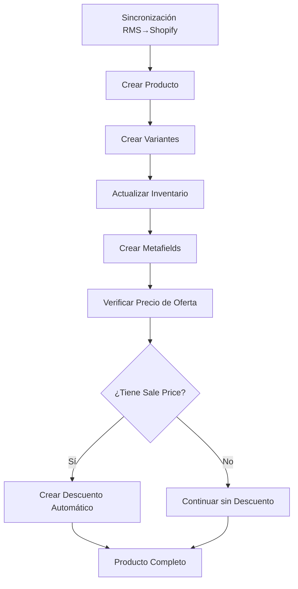

# 🎯 Sistema de Descuentos Automáticos - Implementación

## 📋 Resumen de la Implementación

Se ha implementado un sistema completo de descuentos automáticos que se ejecuta después de la sincronización y actualización de inventario, basado en las fechas de promoción de RMS (`SaleStartDate`, `SaleEndDate`).

## 🔧 Componentes Implementados

### 1. **Gestor de Descuentos** (`app/services/discount_manager.py`)
- **Clase principal**: `DiscountManager`
- **Funcionalidad**: Creación y gestión de descuentos automáticos en Shopify
- **API utilizada**: GraphQL Admin API 2025-04

#### Características principales:
- ✅ Detección automática de productos con precio de oferta
- ✅ Cálculo de porcentaje de descuento basado en `compareAtPrice` vs `price`
- ✅ Soporte para fechas de inicio y fin de promoción
- ✅ Creación de descuentos básicos de Shopify (fallback si no hay app)
- ✅ Creación de descuentos de app (si está disponible)
- ✅ Metafields para tracking de descuentos

### 2. **Integración en el Flujo de Sincronización**

#### En `MultipleVariantsCreator` (`app/services/multiple_variants_creator.py`):
```python
# Paso 5: Crear descuentos automáticos si hay precios de oferta
await self._create_automatic_discounts(product_id, shopify_input)
```

#### En `RMSToShopifySync` (`app/services/rms_to_shopify.py`):
- ✅ Query actualizada para incluir `SaleStartDate`, `SaleEndDate`
- ✅ Conversión de datos para incluir fechas de promoción
- ✅ Integración con el flujo completo de sincronización

#### En `RMSShopifyMapper` (`app/services/rms_shopify_mapper.py`):
- ✅ Metafields agregados para fechas de promoción:
  - `rms.sale_start_date` (date_time)
  - `rms.sale_end_date` (date_time)

### 3. **Esquemas Actualizados**

#### `RMSViewItem` (`app/api/v1/schemas/rms_schemas.py`):
```python
sale_start_date: Optional[datetime] = Field(None, description="Fecha de inicio de promoción")
sale_end_date: Optional[datetime] = Field(None, description="Fecha de fin de promoción")
```

## 🔄 Flujo de Ejecución



## 📊 Tipos de Descuentos Soportados

### 1. **Descuento Automático Básico** (Shopify nativo)
- **Mutation**: `discountAutomaticBasicCreate`
- **Aplicación**: Automática en el producto específico
- **Configuración**: Porcentaje calculado automáticamente

### 2. **Descuento de App** (Si está disponible)
- **Mutation**: `discountAutomaticAppCreate`
- **Funcionalidad**: Más flexible, con metafields personalizados
- **Fallback**: Si no está disponible, usa descuento básico

## 🎯 Configuración de Descuentos

### Metafields de Tracking:
```json
{
  "namespace": "rms_sync",
  "metafields": [
    {
      "key": "discount_percentage",
      "type": "number_decimal",
      "value": "20.00"
    },
    {
      "key": "product_id", 
      "type": "single_line_text_field",
      "value": "gid://shopify/Product/123456"
    }
  ]
}
```

### Combinaciones de Descuentos:
```json
{
  "combinesWith": {
    "productDiscounts": false,
    "shippingDiscounts": true
  }
}
```

## 🧪 Testing

### Script de Prueba: `test_discount_system.py`
- ✅ Creación de producto de prueba con precio de oferta
- ✅ Verificación de creación de descuentos
- ✅ Validación de porcentajes de descuento
- ✅ Verificación de fechas de promoción

### Ejemplo de Uso:
```bash
poetry run python test_discount_system.py
```

## 📋 Validaciones Implementadas

### 1. **Validación de Precio de Oferta**
```python
def _has_sale_price(self, shopify_input: ShopifyProductInput) -> bool:
    """Verifica si el producto tiene precio de oferta."""
    for variant in shopify_input.variants or []:
        if variant.compareAtPrice and variant.price:
            if float(variant.price) < float(variant.compareAtPrice):
                return True
    return False
```

### 2. **Cálculo de Porcentaje**
```python
def _calculate_discount_percentage(self, shopify_input: ShopifyProductInput) -> float:
    """Calcula el porcentaje de descuento basado en los precios."""
    # Retorna el mayor descuento entre todas las variantes
    discount = ((compare_price - sale_price) / compare_price) * 100
    return round(discount, 2)
```

### 3. **Manejo de Errores**
- ✅ No falla la creación del producto si falla el descuento
- ✅ Logging detallado para debugging
- ✅ Fallback a descuento básico si falla el de app

## 🔗 API de Shopify Utilizada

### GraphQL Mutations:
1. **`discountAutomaticBasicCreate`**
   - Para descuentos automáticos básicos
   - Especificación: [Shopify Docs - discountAutomaticBasicCreate](https://shopify.dev/docs/api/admin-graphql/latest/mutations/discountautomaticbasiccreate)

2. **`discountAutomaticAppCreate`**
   - Para descuentos de app (más avanzados)
   - Especificación: [Shopify Docs - discountAutomaticAppCreate](https://shopify.dev/docs/api/admin-graphql/latest/mutations/discountautomaticappcreate)

### GraphQL Queries:
1. **`shopifyFunctions`**
   - Para obtener funciones de descuento disponibles
   - Usado para verificar si hay funciones de app disponibles

## 🚀 Ejecución en Producción

### Configuración Automática:
- ✅ Se ejecuta automáticamente después de crear/actualizar productos
- ✅ Solo se crean descuentos si hay precio de oferta válido
- ✅ Usa fechas de promoción de RMS si están disponibles
- ✅ Fallback a fechas por defecto si no se especifican

### Logging y Monitoreo:
```
🎯 Creating automatic discount for product gid://shopify/Product/123456
✅ Automatic discount created for product gid://shopify/Product/123456
   💳 Discount ID: gid://shopify/DiscountAutomaticBasic/789012
```

## 📈 Beneficios

1. **Automatización Completa**: No requiere intervención manual
2. **Sincronización de Promociones**: Las ofertas de RMS se reflejan automáticamente en Shopify
3. **Flexibilidad**: Soporta múltiples tipos de descuentos
4. **Robustez**: Manejo de errores sin afectar la sincronización principal
5. **Rastreabilidad**: Metafields para tracking y auditoría

## ⚙️ Configuración Requerida

### Variables de Entorno:
- ✅ Utiliza la misma configuración de Shopify existente
- ✅ No requiere configuración adicional

### Permisos de Shopify:
- ✅ `write_discounts` - Para crear descuentos
- ✅ `read_discounts` - Para verificar descuentos existentes
- ✅ `write_products` - Ya disponible
- ✅ `read_products` - Ya disponible

## 🔄 Futuras Mejoras

1. **Gestión de Descuentos Existentes**: Actualizar o eliminar descuentos cuando cambian las promociones
2. **Descuentos por Categoría**: Descuentos aplicables a múltiples productos
3. **Integración con Códigos de Descuento**: Crear códigos de cupón además de descuentos automáticos
4. **Dashboard de Promociones**: Interface para gestionar descuentos desde el admin

---

**Estado**: ✅ **Implementado y Listo para Pruebas**  
**Última Actualización**: 2025-06-26  
**Responsable**: Claude AI Assistant