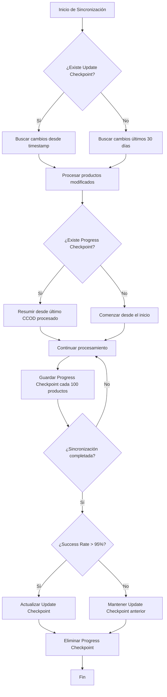

# Sistema de Checkpoints - RMS to Shopify Integration

## 📚 Resumen

Este sistema utiliza DOS tipos diferentes de checkpoints para gestionar las sincronizaciones:

## 1. 📅 **Update Checkpoint** (Checkpoint de Última Actualización)
- **Ubicación**: `./checkpoint/checkpoint.json`
- **Propósito**: Rastrea la ÚLTIMA vez que se ejecutó una sincronización exitosa
- **Clase**: `UpdateCheckpointManager` en `app/utils/update_checkpoint.py`
- **Uso Principal**: 
  - Determinar desde cuándo buscar cambios en RMS (campo `Item.LastUpdated`)
  - Evitar procesar todos los productos en cada ejecución
  - Solo sincronizar productos nuevos o modificados

### Formato del archivo:
```json
{
  "last_run_timestamp": "2025-09-24T13:17:40.122088+00:00",
  "updated_at": "2025-09-24T13:17:40.122100+00:00",
  "version": "1.0"
}
```

### Flujo de trabajo:
1. Al iniciar sincronización → Lee el timestamp de última ejecución
2. Busca productos con `LastUpdated > last_run_timestamp`
3. Si la sincronización es exitosa (>95% success rate) → Actualiza el checkpoint
4. Si no hay checkpoint → Busca cambios de los últimos 30 días (configurable)

---

## 2. 📊 **Progress Checkpoint** (Checkpoint de Progreso)
- **Ubicación**: `./checkpoints/[sync_id].json`
- **Propósito**: Guarda el PROGRESO de una sincronización en curso
- **Clase**: `SyncCheckpointManager` en `app/services/sync_checkpoint.py`
- **Uso Principal**:
  - Permitir reanudar una sincronización interrumpida
  - No perder progreso si el proceso se detiene
  - Rastrear estadísticas de la sincronización actual

### Formato del archivo:
```json
{
  "sync_id": "rms_to_shopify_20250924_193054",
  "timestamp": "2025-09-24T19:59:31.746735+00:00",
  "last_processed_ccod": "26IK03",
  "processed_count": 116,
  "total_count": 465,
  "batch_number": 1,
  "progress_percentage": 24.95,
  "stats": {
    "total_processed": 116,
    "created": 0,
    "updated": 116,
    "errors": 0,
    "skipped": 0
  }
}
```

### Flujo de trabajo:
1. Durante sincronización → Guarda progreso cada 100 productos (configurable)
2. Si se interrumpe → Al reiniciar, detecta el checkpoint y resume desde donde quedó
3. Al completar exitosamente → Elimina el checkpoint de progreso

---

## 🔄 Interacción entre ambos sistemas



---

## ⚙️ Configuración

En `.env` o variables de entorno:

```bash
# Update Checkpoint
USE_UPDATE_CHECKPOINT=True              # Habilitar sistema de checkpoint de actualización
CHECKPOINT_DEFAULT_DAYS=30             # Días hacia atrás si no hay checkpoint
CHECKPOINT_SUCCESS_THRESHOLD=0.95      # Umbral de éxito para actualizar checkpoint

# Progress Checkpoint  
SYNC_CHECKPOINT_INTERVAL=100           # Guardar progreso cada N productos
```

---

## 🎯 Casos de uso

### Sincronización automática de cambios:
1. **ChangeDetector** usa Update Checkpoint para saber desde cuándo buscar
2. Encuentra productos modificados en las últimas horas/días
3. Sincroniza solo esos productos
4. Actualiza Update Checkpoint si todo sale bien

### Sincronización completa manual:
1. Ignora Update Checkpoint (procesa todos los productos)
2. Usa Progress Checkpoint para poder resumir si se interrumpe
3. Al final, actualiza Update Checkpoint con el timestamp actual

### Recuperación de interrupciones:
1. Progress Checkpoint permite continuar donde se quedó
2. Update Checkpoint no se modifica hasta completar exitosamente
3. Si falla repetidamente, mantiene el último checkpoint exitoso

---

## ⚠️ Notas importantes

1. **NO confundir** los dos tipos de checkpoints
2. Update Checkpoint se actualiza SOLO con sincronizaciones exitosas
3. Progress Checkpoint es temporal y se elimina al completar
4. Si se elimina Update Checkpoint manualmente, el sistema buscará cambios de los últimos 30 días
5. Los checkpoints usan UTC para evitar problemas de zona horaria